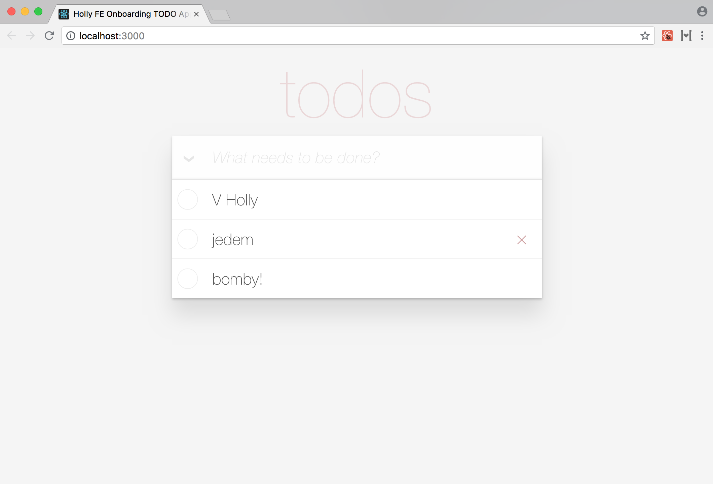
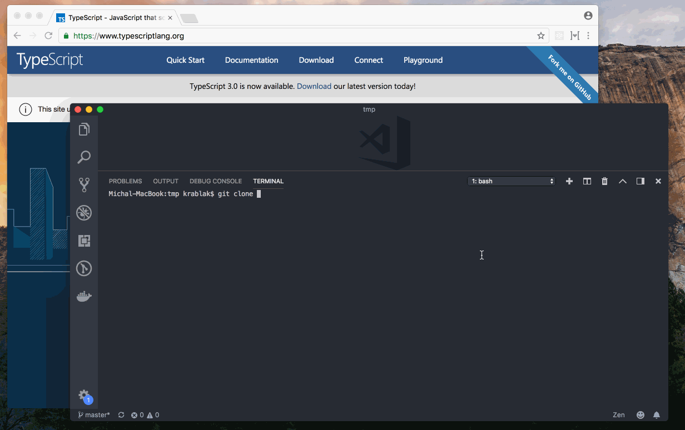

# Holly FE "onboarding" [REPO BACKUP] 
Tak tohle je přesně to místo, kde začít, když chceš dělat frontend u nás v Holly. Najdeš tu:

- Klasický sample **TODO list** za použití přesně těch principů a technologií, které používáme.
- Seznam **dokumentace**, se kterou je dobré se seznámit a kde hledat, pokud něco není jasné.

## TODO list 

### Co mít nainstalováno

- Poslední verzi [Node.js](https://nodejs.org/en/)
- Poslední verzi [Yarn](https://yarnpkg.com/en/)

### Jak to spustit

    yarn install
    yarn start

### Build

    yarn install
    yarn build

Výsledek buildu je ve složce *build*.

### Testy
V *src/_\_tests__* jsou ukázky třech typů testů:

- **Smoke.test.tsx** způsob jak zjistit, jestli se nám vůbec podaří komponentu inicializovat.
- **Snapshot.test.tsx** testy, které nám řeknou, jestli se v našich UI komponentách něco změnilo (to, jestli to byla změna k lepšímu, už zkontrolujeme sami).
- **Unit.test.ts** klasický unit test.

Jak spustit testy:

    yarn test

### MobX DevTools
MobX DevTools jsou skvělý pomocník, pokud jde o vizualizaci toho, kdy a co se na obrazovce překresluje. 

Jak je zapnout:

1. Otevřít soubor *src/App.tsx*.
2. Změnit konstantu **enableDevTools** na **true**.

### Máš dotaz nebo se ti něco nezdá?

  1. Zeptej se někoho z nás.
  2. Nikoho z nás neznáš. Nevadí, dej nám vědet na twitteru [@HollySolutions](https://twitter.com/HollySolutions) nebo třeba na mail [michal.racek@hollysolutions.cz](mailto:michal.racek@hollysolutions.cz).
  3. A jestli je něco fakt blbě, máme na gitlabu otevřené [issues](https://gitlab.com/holly-prototypes/feonboard/issues). Zpětná vazba je pro nás fakt důležitá.

## Dokumentace
### React
Je třeba načíst pouze základní principy fungování:

- [Dokumentace](https://reactjs.org/docs/hello-world.html)
    - [Introducing JSX](https://reactjs.org/docs/introducing-jsx.html)
    - [Rendering Elements](https://reactjs.org/docs/introducing-jsx.html)
    - [Components and Props](https://reactjs.org/docs/components-and-props.html)
    - [Conditional Rendering](https://reactjs.org/docs/conditional-rendering.html)
    - [Lists and Keys](https://reactjs.org/docs/lists-and-keys.html)

Zkusit si jednoduché příklady v sandboxech a trochu si s nimi pohrát:

- [Hello, world!](https://codesandbox.io/s/vn1k4rrml7)
- [Simple List](https://codesandbox.io/s/vy9porn4x3)
- [List Add/Remove](https://codesandbox.io/s/144pzz1q4l)

### Typescript
Prosvištět dokumentaci:

- [Dokumentace](https://www.typescriptlang.org/docs/home.html)
    - [Basic Types](https://www.typescriptlang.org/docs/handbook/basic-types.html)
    - [Variable Declarations](https://www.typescriptlang.org/docs/handbook/variable-declarations.html)
    - [Interfaces](https://www.typescriptlang.org/docs/handbook/interfaces.html)
    - [Classes](https://www.typescriptlang.org/docs/handbook/classes.html)
    - [Functions](https://www.typescriptlang.org/docs/handbook/functions.html)
    - [Enums](https://www.typescriptlang.org/docs/handbook/enums.html)
    - [JSX](https://www.typescriptlang.org/docs/handbook/jsx.html)

### Typescript + React
Na vyzkoušení Reactu s Typescriptem dohromady je nejlepší zkusit si rozjet Hello World s React create app s podporou TS: [https://github.com/wmonk/create-react-app-typescript](https://github.com/wmonk/create-react-app-typescript)

Jen v návodu místo **npm** zkus použít [Yarn](https://yarnpkg.com/en/). Stačí mít yarn nainstalován, a tam, kde je v postupu **npm**, tak nahradit použitím **yarnu**.

**A nebo tuhle část preskočit a rozvalit hned náš TODO list sample.**

### MobX
MobX není třeba znát uplně detailně, ale pro zbežné seznámení stačí mrknout sem:

- [The gist of MobX](https://mobx.js.org/intro/overview.html)
- [Concepts & Principles](https://mobx.js.org/intro/concepts.html)

A pohrát si třeba s tímto příkladem: [https://codesandbox.io/s/v3v0my2370](https://codesandbox.io/s/v3v0my2370)

### IDE
Pro vývoj používáme [VSCode](https://code.visualstudio.com), ale klidně použij WebStorm nebo cokoliv ti sedí. Pro VSCode pak doporučuji následující rozšíření:

-  [TSLint](https://marketplace.visualstudio.com/items?itemName=eg2.tslint)
-  [Markdown All in One](https://marketplace.visualstudio.com/items?itemName=yzhang.markdown-all-in-one)
-  [IntelliJ IDEA Keybindings](https://marketplace.visualstudio.com/items?itemName=k--kato.intellij-idea-keybindings)
-  [Debugger for Chrome](https://marketplace.visualstudio.com/items?itemName=msjsdiag.debugger-for-chrome)
-  [Atom One Dark Theme](https://marketplace.visualstudio.com/items?itemName=akamud.vscode-theme-onedark)
